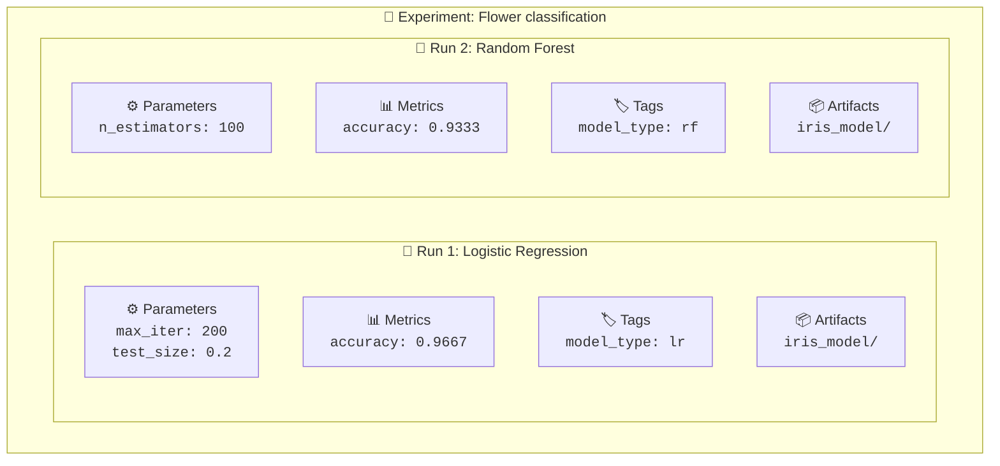
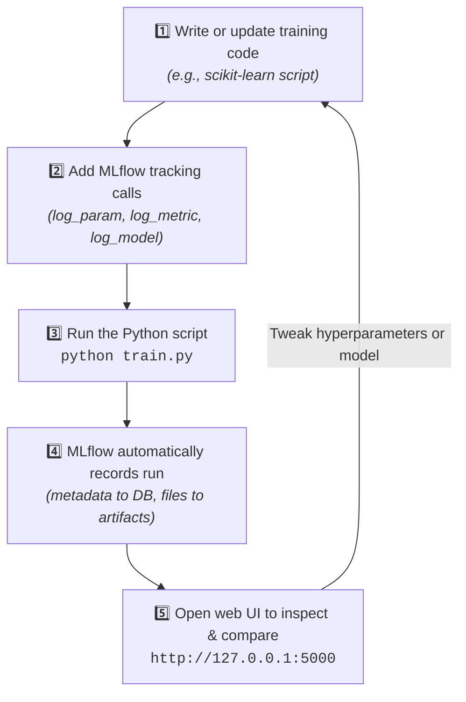

<div align="center">

<p align="center">
  <a href="../README.md">🏠 Home</a> •
  <b>Lesson 01: Introduction</b> •
  <a href="../02-Setup/README.md">Lesson 02: Setup ➡️</a>
</p>

# 📖 Lesson 01: Introduction to MLflow
### *Core Concepts, Terminology & The Experiment Lifecycle*

</div>

Before you write any code, it helps to understand what MLflow is, what problem it solves, and what words like "run" and "artifact" mean. This lesson is all concepts. You will not install or run anything yet. That starts in [Lesson 02](../02-Setup/README.md).

> [!NOTE]
> **Version note:** This tutorial targets **MLflow 3.17.0**. See the [root README](../README.md#%EF%B8%8F-technology-stack) for all package versions.

---

## 🎯 1. Learning objectives

By the end of this lesson you will be able to:

- 💬 **Describe in your own words** what MLflow is.
- 🔬 **Explain why** tracking machine learning experiments matters.
- ⚠️ **List the problems** of tracking experiments by hand.
- 🧩 **Name the main parts** of MLflow that this tutorial uses.
- ⚖️ **Tell the difference** between an experiment and a run.
- 🏷️ **Tell the difference** between a parameter, a metric, a tag, and an artifact.
- 🖥️ **Explain** what the MLflow tracking UI is for.
- 🗺️ **Describe** what you will build in the rest of this series.

---

## 📋 2. Prerequisites

- Basic Python knowledge.
- Some familiarity with machine learning: you know what it means to train a model, split data into training and test sets, and measure accuracy.
- Nothing to install for this lesson.

---

## 💥 3. The problem: experiments get messy

Imagine you are training a model to classify flowers. Your first try gives 90% accuracy. You change a setting and run it again: 93%. You change the data split: 91%. A week later you try a different model type: 95%.

Now a friend asks, *"Which settings gave you 95%?"* If you are like most beginners, your project folder looks something like this:

```text
📁 my-ml-project/
├── model.pkl
├── model_final.pkl
├── model_final_v2.pkl
├── model_final_v2_REAL.pkl
├── results.xlsx
└── notes.txt
```

Tracking experiments by hand causes real problems:

| Problem | Example |
|:---|:---|
| ❓ **You forget the settings** | *"Was it 50 trees or 100 trees?"* |
| 🔄 **You cannot reproduce a result** | You lost the exact combination of data split and settings |
| 📑 **Results are scattered** | Numbers are in a notebook, a spreadsheet, and your memory |
| 🏷️ **File names do not explain themselves** | Which of the `model_final` files is the good one? |
| ⏱️ **Comparing is slow** | You copy numbers into a table every time |
| 👥 **Teamwork is hard** | Others cannot see what you tried |

**Experiment tracking** solves this by recording, for every training attempt, what you did and what happened, in one organized place.

> [!TIP]
> **Analogy:** Think of a scientist's lab notebook. A good scientist writes down the date, the exact conditions of each experiment, the measurements, and any files produced. MLflow is a lab notebook that your code fills in automatically.

---

## ⚡ 4. What is MLflow?

MLflow is an open-source platform for managing the machine learning workflow. According to the official documentation, **MLflow Tracking** is an API and a UI for logging parameters, code versions, metrics, and output files when you run your machine learning code, and for visualizing the results later ([MLflow Tracking](https://mlflow.org/docs/latest/ml/tracking/)).

In plain English: you add a few lines to your training script, and MLflow writes down what happened. Then you open a web page and browse the history.

> [!NOTE]
> MLflow does **not** train models for you. You still write the training code with a library such as scikit-learn. MLflow only records and organizes what your code does.

### The main components used in this tutorial

| Component | What it does | Where we use it |
|:---|:---|:---:|
| **Tracking** | Records parameters, metrics, tags, and files for each run, and lets you view them in a web UI | Lessons 03 to 06 |
| **Models** | A standard way to save a trained model together with information about how to load and use it | Lesson 07 |
| **Model Registry** | A central place to store named, versioned models | Lesson 07 |

MLflow has other features too, such as model evaluation tools, deployment tools, and features for LLM and agent applications. This tutorial focuses on the three above, because they cover the core workflow for a beginner. You can explore the rest in the [official documentation](https://mlflow.org/docs/latest/ml/).

---

## 🔑 5. Key concepts

These five words appear in every lesson. Take your time with them.



### Run
A **run** is one execution of your training code. If you run `python train.py` once, that is one run. Each run records its own settings, results, and output files.

### Experiment
An **experiment** is a group of related runs. The official documentation describes an experiment as a group of runs (and models) for a specific task ([MLflow Tracking, Concepts](https://mlflow.org/docs/latest/ml/tracking/#concepts)).

> [!TIP]
> **Analogy:** An experiment is a folder in your lab notebook titled *"Flower classification"*. Each run is one page in that folder.

### What a run records

| Item | What it is | Iris example |
|:---|:---|:---|
| ⚙️ **Parameter** | A setting you choose **before** training. It is an input. | `max_iter = 200` |
| 📊 **Metric** | A number that measures **results**. It is an output. | `accuracy = 0.97` |
| 🏷️ **Tag** | A label you attach to help you find and organize runs. | `model_type = logistic_regression` |
| 📦 **Artifact** | An output **file** saved with the run, such as a trained model or an image. | The saved model files |

**A simple way to remember it:**
- ⚙️ **Parameters** go **in** (what you chose).
- 📊 **Metrics** come **out** (how well it did).
- 🏷️ **Tags** are **labels** (notes for you).
- 📦 **Artifacts** are **files** (things your run produced).

### The tracking UI

MLflow includes a web interface called the **tracking UI**. According to the official documentation, it lets you:

- 📋 List and compare runs by experiment.
- 🔎 Search for runs by parameter or metric value.
- 📈 Visualize run metrics.
- 💾 Download run results, including artifacts and metadata.

You open it in your browser. You do not need to write any code to use it. We start it in Lesson 02 and use it from Lesson 03 onward.

---

## 🔄 6. The workflow at a glance

Every lesson in this series follows the same cycle:



---

## 💻 7. A conceptual example

Below is a small illustration of how MLflow lines fit into a training script. **This is for understanding only. Do not run it yet.** It uses made-up variable names and is not a complete program. Real, complete, runnable code starts in [Lesson 03](../03-First-experiment/README.md).

```python
import mlflow

# 1. Which experiment folder does this run belong to?
mlflow.set_experiment("Flower classification")

# 2. Open a new run
with mlflow.start_run():
    # Input setting (parameter)
    mlflow.log_param("max_iter", 200)

    # ... train the model and measure its accuracy here ...

    # Output result (metric)
    mlflow.log_metric("accuracy", 0.97)

    # Label for organization (tag)
    mlflow.set_tag("model_type", "logistic_regression")
```

**What each part does:**

- `mlflow.set_experiment(...)` chooses the experiment (the group) the run belongs to.
- `with mlflow.start_run():` opens a run. Everything logged inside the block is saved to that run, and the run is closed when the block ends.
- `mlflow.log_param(...)` records a parameter.
- `mlflow.log_metric(...)` records a metric.
- `mlflow.set_tag(...)` records a tag.

These function names come from the [MLflow Tracking documentation](https://mlflow.org/docs/latest/ml/tracking/#start-logging) and the [Tracking Quickstart](https://mlflow.org/docs/latest/ml/tracking/quickstart/). The value `0.97` is a made-up number for illustration.

---

## ⌨️ 8. Commands to run

There are no commands to run in this lesson. Everything starts in [Lesson 02](../02-Setup/README.md).

---

## 🖥️ 9. What you will see in the MLflow UI

You will not open the UI in this lesson. When you do, starting in Lesson 03, you will be looking at the following, based on the official description of the UI:

| In the UI you will find | Which comes from |
|:---|:---|
| 📁 A list of experiments | Your calls to `mlflow.set_experiment(...)` |
| 📋 A table of runs inside an experiment | Each time you ran your script |
| ⚙️ Parameters and metrics for each run | `log_param` and `log_metric` calls |
| 🏷️ Tags for each run | `set_tag` calls |
| 📦 Files and models attached to a run | Logged artifacts and models |

> [!NOTE]
> Real screenshots will be added to the repository after the lessons have been run on a working setup. This lesson deliberately has none.

---

## 🏗️ 10. What you will build in this series

| Lessons | What you will build |
|:---:|:---|
| **02** | A working MLflow setup on your computer |
| **03** | Your first tracked experiment: train a classifier on the Iris dataset and log it |
| **04** | A deeper look at runs, tags, artifacts, and where MLflow stores data, using the same example |
| **05** | The same workflow using autologging |
| **06** | A fair comparison of several models, and a justified choice |
| **07** | Loading a logged model for predictions, and an introduction to the Model Registry |
| **08** | A small, tested, reproducible end-to-end project |

> [!TIP]
> The tutorials use scikit-learn's built-in Iris dataset, so you do not need to download any data.

---

## ⚠️ 11. Common misunderstandings

This lesson has no code, so there are no error messages. These are the most common wrong ideas beginners have at this stage:

| Misunderstanding | Reality |
|:---|:---|
| ❌ *"MLflow trains my model."* | **No.** You write the training code. MLflow records what happens. |
| ❌ *"MLflow is only for big teams."* | **No.** It is useful when you are working alone, as soon as you have more than a couple of experiments. |
| ❌ *"A metric and a parameter are the same."* | **No.** A parameter is a setting you choose. A metric is a result you measure. |
| ❌ *"An experiment is one training attempt."* | **No.** One attempt is a **run**. An experiment is a group of runs. |
| ❌ *"I have to use the web UI to log things."* | **No.** Logging is done from your Python code. The UI is for viewing and comparing. |

---

## 🧠 12. Practice exercises

1. **Sort the items.** For each item, decide whether it is a parameter, metric, tag, or artifact:
   - The number of trees in a random forest
   - Test accuracy
   - A saved image of a confusion matrix
   - A note saying "baseline model"
   - The learning rate
   - The F1 score
2. **Spot the problem.** Think of a past project (or imagine one). Write down two ways that tracking by hand could have caused trouble.
3. **Runs and experiments.** You train three different models on the same task, and you train each one twice. How many runs is that? How many experiments would you normally use?

<details>
<summary><b>🔍 Reveal Answers to Practice Exercises</b></summary>

<br/>

1. **Classification:**
   - Number of trees: **Parameter**
   - Test accuracy: **Metric**
   - Saved confusion matrix image: **Artifact**
   - Note saying "baseline model": **Tag**
   - Learning rate: **Parameter**
   - F1 score: **Metric**
2. **Spot the problem:** Any reasonable answers. Common ones include forgetting which settings produced the best result, and not being able to find or recreate a model file.
3. **Runs and experiments:** **Six runs** (3 models × 2 times each). You would normally use **one** experiment, because all six runs are for the same task.

</details>

---

## 🏆 13. Small challenge

Think of a machine learning task you have done or would like to do. On paper, write down:

- [ ] A name for the experiment.
- [ ] Three parameters you would want to record.
- [ ] Two metrics you would want to record.
- [ ] One tag that would help you find the run later.
- [ ] One artifact you would want saved.

You will use the same thinking in [Lesson 03](../03-First-experiment/README.md), where you do this for real.

---

## 📝 14. Summary

- 🔬 **Experiment tracking** means recording what you did and what happened for every training attempt, so you can compare, reproduce, and explain your results.
- ⚡ **MLflow** records this information. It does not train your model for you.
- 🏃 A **run** is one execution of your code. An **experiment** is a group of related runs.
- 📥 **Parameters** are inputs you choose, 📤 **metrics** are results you measure, 🏷️ **tags** are labels, and 📦 **artifacts** are files.
- 🖥️ The **tracking UI** is a web page where you browse, search, and compare runs.
- 🧱 This tutorial uses Tracking, Models, and the Model Registry.

---

## 📚 Official documentation & Next steps

- [MLflow documentation for machine learning](https://mlflow.org/docs/latest/ml/)
- [MLflow Tracking](https://mlflow.org/docs/latest/ml/tracking/)
- [MLflow Tracking Quickstart](https://mlflow.org/docs/latest/ml/tracking/quickstart/)

<div align="center">
  <br/>
  <a href="../02-Setup/README.md"><b>Next: Lesson 02: Installation and Setup ➡️</b></a>
</div>