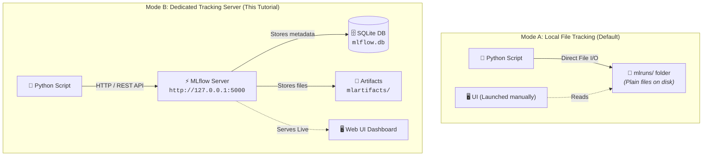
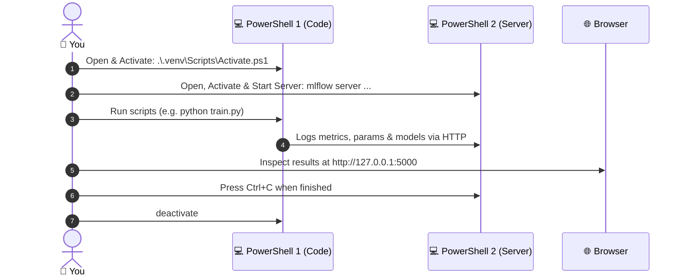

<div align="center">

<p align="center">
  <a href="../01-Introduction/README.md">⬅️ Lesson 01: Introduction</a> •
  <a href="../README.md">🏠 Home</a> •
  <b>Lesson 02: Setup</b> •
  <a href="../03-First-experiment/README.md">Lesson 03: First Experiment ➡️</a>
</p>

# ⚙️ Lesson 02: Installation and Setup
### *Local Environment, SQLite Backend & Tracking Server on Windows 11*

</div>

In this lesson you will get a working MLflow setup on your computer: a virtual environment, the right packages, and a running MLflow tracking server with its web interface. By the end you will log a tiny test run and see it in your browser.

> [!IMPORTANT]
> **Operating system:** Every command in this lesson is specifically crafted for **Windows 11 with Windows PowerShell**. Other systems use different commands and are not covered here.

> [!NOTE]
> **Version note:** This tutorial targets **MLflow 3.17.0** on **Python 3.13**. See the [root README](../README.md#%EF%B8%8F-technology-stack) for all versions.

---

## 🎯 1. Learning objectives

By the end of this lesson you will be able to:

- 🔍 **Check** which Python version you have.
- 📦 **Create, activate, and deactivate** a virtual environment.
- 📥 **Install** the exact package versions used in this tutorial.
- ⚖️ **Explain the difference** between local file tracking and a tracking server.
- 🚀 **Start and stop** the MLflow tracking server and open its web interface.
- 🐍 **Run a Python script** that logs a run to the server.
- 🛠️ **Fix** the most common setup problems.

---

## 📋 2. Prerequisites

- Completed [Lesson 01](../01-Introduction/README.md).
- A Windows 11 computer with Python 3.13 installed.
- Git installed, if you want to clone the repository. (You can also download the repository as a ZIP file from GitHub).

---

## 💡 3. Concepts in plain English

### What is a virtual environment?

A **virtual environment** is a private folder of Python packages for one project. Without one, every project on your computer shares the same packages, and a package update for one project can break another. With one, this tutorial gets its own isolated set of packages with the exact versions it needs.

### Two ways MLflow can store your data

MLflow always needs somewhere to keep two kinds of information:

- **Metadata:** Parameters, metrics, tags, run names (small pieces of information).
- **Artifacts:** Output files such as trained models.



| Feature | Local File Tracking | Tracking Server *(used in this tutorial)* |
|:---|:---|:---|
| **How it works** | Your script writes files directly into a local folder (by default `mlruns`) | A separate MLflow program runs in the background. Your script sends data to it, and it stores the data |
| **Web interface** | Start it separately when you want to look | Built in, always available while the server runs |
| **Extra setup** | None | Start the server in a second terminal window |
| **Model Registry (Lesson 07)** | Needs a database-backed store, so not available with plain files | Available when the server uses a database |

The official documentation describes the default as logging to a local `mlruns` directory, and says the Model Registry requires a database-backed store ([MLflow Tracking](https://mlflow.org/docs/latest/ml/tracking/)).

### The configuration used in this tutorial

Every lesson from here on uses the exact same setup:

| Setting | Value | Description |
|:---|:---:|:---|
| **Server address** | `http://127.0.0.1:5000` | Reachable only from your own machine (`localhost`) |
| **Metadata storage** | `sqlite:///mlflow.db` | A single SQLite database file in the repository root |
| **Artifact storage** | `mlartifacts` | A local folder created automatically in the root |
| **Working Directory** | **Repository root folder** | Where the server and commands must be executed |

SQLite is a lightweight database stored in a single file that needs no separate installation. Using a database from the start means the Model Registry in Lesson 07 works seamlessly without needing to alter your setup later.

---

## 🚀 4. Step-by-step instructions

Every command below is run in **Windows PowerShell**. To open it:
> Press <kbd>Win</kbd> ➔ Type `PowerShell` ➔ Press <kbd>Enter</kbd>.

---

### Step 1: Check your Python version

```powershell
python --version
```

This prints the version of Python that PowerShell finds. This tutorial was tested with **Python 3.13.3**.

> [!WARNING]
> If you see an error such as `python is not recognized`, Python is not installed or not on your PATH. See [Common errors](#10-common-errors-and-solutions).

To see all Python versions installed on your computer, you can run:

```powershell
py -0p
```

---

### Step 2: Get the project folder

If you are following along from the GitHub repository, clone it:

```powershell
git clone <repository-url>
cd mlflow-for-beginners
```

*`git clone` downloads a copy of the repository. `cd` ("change directory") moves PowerShell into that folder.*

If you are creating the project from scratch instead:

```powershell
mkdir mlflow-for-beginners
cd mlflow-for-beginners
```

From now on, **the repository root** means this `mlflow-for-beginners` folder. You can verify your location at any time with:

```powershell
Get-Location
```

---

### Step 3: Create a virtual environment

Run this in the repository root:

```powershell
python -m venv .venv
```

This creates a folder named `.venv` containing a private copy of Python. The folder is listed in `.gitignore`, so it is never committed to Git.

---

### Step 4: Activate the virtual environment

```powershell
.\.venv\Scripts\Activate.ps1
```

When it works, your PowerShell prompt will start with `(.venv)`, like this:

```text
(.venv) PS C:\...\mlflow-for-beginners>
```

That prefix confirms the environment is active.

> [!IMPORTANT]
> **You must activate the environment in every new PowerShell window** before running tutorial commands.

> [!WARNING]
> If you get an error about running scripts being disabled, see [Common errors](#10-common-errors-and-solutions).

To leave the environment later:

```powershell
deactivate
```

---

### Step 5: Install the required packages

Make sure `(.venv)` is showing, then run:

```powershell
python -m pip install -r requirements.txt
```

This reads `requirements.txt` and installs the exact versions listed there:

```text
mlflow==3.17.0
scikit-learn==1.9.1
pandas==3.0.6
numpy==2.5.3
```

*(Using `python -m pip` instead of plain `pip` ensures packages go into the Python environment that is currently active).*

---

### Step 6: Verify the installation

Check for broken dependencies:

```powershell
python -m pip check
```

*Expected output:*
```text
No broken requirements found.
```

Then check that everything imports cleanly with the expected versions:

```powershell
python -c "import mlflow, sklearn, pandas, numpy; print(mlflow.__version__, sklearn.__version__, pandas.__version__, numpy.__version__)"
```

*Expected output:*
```text
3.17.0 1.9.1 3.0.6 2.5.3
```

If your numbers differ, repeat Step 5 and make sure `(.venv)` is showing.

---

### Step 7: Start the MLflow tracking server

Open a **second PowerShell window**. Keep your first window open too.

In the **second window**, navigate to the repository root and activate the environment:

```powershell
cd <path-to>\mlflow-for-beginners
.\.venv\Scripts\Activate.ps1
```

Then launch the server:

```powershell
mlflow server --backend-store-uri sqlite:///mlflow.db --host 127.0.0.1 --port 5000
```

**What the options mean:**

| Option | Meaning |
|:---|:---|
| `--backend-store-uri sqlite:///mlflow.db` | Store metadata in a SQLite file named `mlflow.db` in the current folder |
| `--host 127.0.0.1` | Accept connections only from this computer |
| `--port 5000` | Listen on port 5000 |

> [!NOTE]
> The server keeps running and prints log lines continuously. **That is completely normal.** The window will not give you a prompt back while the server is active, which is why you use a second window for running scripts.
>
> Because artifact serving is on by default, the server stores artifacts in a local `mlartifacts` folder in the directory where it was started ([Tracking Server documentation](https://mlflow.org/docs/latest/self-hosting/architecture/tracking-server/)). This is why you must always start the server from the repository root: `mlflow.db` and `mlartifacts` stay organized in one place, and Git ignores both.

---

### Step 8: Open the web interface

Open your browser and navigate to:

```text
http://127.0.0.1:5000
```

You should see the MLflow user interface. There is nothing in it yet except a default experiment.

> [!TIP]
> **Two views: GenAI vs Model training:**  
> In MLflow 3.17.0, the top-left of the interface (under the version number) has a switch with two options: **GenAI** and **Model training**.  
> - **GenAI** is for tracing LLM and agent applications.  
> - **Model training** is for classical machine learning models.  
>  
> **Always use Model training in this tutorial.** If you land on a page with "Traces", "Sessions", or "No data available", click **Model training** in the top-left corner to switch.

---

### Step 9: Run a Python script that logs to the server

Go back to your **first PowerShell window** (the one with `(.venv)` showing, not the server window). Make sure you are in the repository root, then run:

```powershell
@'
import mlflow

mlflow.set_tracking_uri("http://127.0.0.1:5000")
mlflow.set_experiment("setup-check")

with mlflow.start_run(run_name="hello-mlflow"):
    mlflow.log_param("greeting", "hello")
    mlflow.log_metric("answer", 42)

print("Logged one run. Open http://127.0.0.1:5000 to see it.")
'@ | python -
```

*(This PowerShell "here-string" pipes the Python program directly into Python, so you do not need to create a temporary file. Be careful to copy everything, including `@'` and `'@ | python -`, ensuring `'@` is at the very beginning of its line).*

**What the code does:**
- `mlflow.set_tracking_uri(...)` tells your script where the server is running.
- `mlflow.set_experiment("setup-check")` selects the experiment, creating it automatically if needed.
- `mlflow.start_run(run_name="hello-mlflow")` opens a run with a readable name.
- `mlflow.log_param(...)` and `mlflow.log_metric(...)` record one parameter and one metric.

---

## 📋 5. Expected output

In your script window, you should see output similar to this (the run ID will differ):

```text
View run hello-mlflow at: http://127.0.0.1:5000/#/experiments/1/runs/<a-long-id>
View experiment at: http://127.0.0.1:5000/#/experiments/1
Logged one run. Open http://127.0.0.1:5000 to see it.
```

---

## 🔍 6. What to inspect in the MLflow UI

Refresh **`http://127.0.0.1:5000`** in your browser, ensure **Model training** is selected, and verify:

1. 📂 An experiment named **setup-check** appears in the experiment list on the left.
2. 🏃 Click it. A run named **hello-mlflow** is displayed.
3. 📊 Click the run name. You should see parameter `greeting = hello` and metric `answer = 42`.

Back in your repository folder, you will also notice `mlflow.db` and, once a model has been logged (starting in Lesson 03), a `mlartifacts` directory.

---

## ⏹️ 7. Stopping the server

In the **server window** (Terminal 2), press:
> <kbd>Ctrl</kbd> + <kbd>C</kbd>

The server stops and returns your command prompt.

> [!NOTE]
> **Your data is not lost.** It is safely stored in `mlflow.db` and `mlartifacts`. Next time, start the server again with the same command from the repository root, and all your past runs and metrics will still be there.

> [!IMPORTANT]
> **Always start the server from the repository root.** If you start it from a subdirectory, MLflow will create a separate, empty `mlflow.db` file there, making your earlier runs appear to be missing.

---

## 🔄 8. Your daily routine

Every time you sit down to work through this tutorial series:



1. Open **PowerShell Window 1**, go to repository root, and run `.\.venv\Scripts\Activate.ps1`.
2. Open **PowerShell Window 2**, go to repository root, activate the environment, and run the `mlflow server ...` command from Step 7.
3. Run your scripts in **Window 1**. View results at `http://127.0.0.1:5000`.
4. When finished, press <kbd>Ctrl</kbd> + <kbd>C</kbd> in **Window 2** and run `deactivate` in both windows.

---

## 📁 9. Files in this lesson

| File | Status | Description |
|:---|:---:|:---|
| `requirements.txt` | New | Created at the repository root. Reused by all later lessons. |
| `.gitignore` | New | Keeps `.venv`, `mlflow.db`, and `mlartifacts` out of Git. |

---

## ⚠️ 10. Common errors and solutions

<details open>
<summary><b>1. <code>python</code> is not recognized</b></summary>

> Python is not installed or is not on your system PATH. Install Python 3.13 from [python.org](https://www.python.org/downloads/) and make sure to check **Add python.exe to PATH** during installation. Then open a new PowerShell window. You can also try `py --version`, which uses the Windows Python launcher.
</details>

<br/>

<details open>
<summary><b>2. Activation error: <i>"running scripts is disabled on this system"</i></b></summary>

> Windows restricts PowerShell scripts by default. To enable execution of local scripts for your user account:
> ```powershell
> Set-ExecutionPolicy -Scope CurrentUser -ExecutionPolicy RemoteSigned
> ```
> Type `Y` to confirm when prompted, then run the activation script again.
</details>

<br/>

<details open>
<summary><b>3. Prompt does not show <code>(.venv)</code></b></summary>

> The environment is not active. Run `.\.venv\Scripts\Activate.ps1` in that window. You can verify which Python interpreter is active with:
> ```powershell
> Get-Command python
> ```
> The output path should end with `.venv\Scripts\python.exe`.
</details>

<br/>

<details open>
<summary><b>4. <code>ModuleNotFoundError: No module named 'mlflow'</code></b></summary>

> You are using a Python environment that does not have MLflow installed. Verify that `(.venv)` is visible in your prompt, then rerun:
> ```powershell
> python -m pip install -r requirements.txt
> ```
</details>

<br/>

<details open>
<summary><b>5. <code>mlflow</code> is not recognized when starting the server</b></summary>

> The virtual environment is not activated in that window. Activate it, or run MLflow via the Python module explicitly:
> ```powershell
> python -m mlflow server --backend-store-uri sqlite:///mlflow.db --host 127.0.0.1 --port 5000
> ```
</details>

<br/>

<details open>
<summary><b>6. The port is already in use (Port 5000 occupied)</b></summary>

> Another MLflow server or background program is already using port 5000.  
> To find what process owns port 5000:
> ```powershell
> Get-NetTCPConnection -LocalPort 5000 | Select-Object LocalAddress, State, OwningProcess
> ```
> Look up the process details using the ID from `OwningProcess`:
> ```powershell
> Get-Process -Id <number>
> ```
> - If it is an old server you want to stop: `Stop-Process -Id <number>`
> - If you want to use a different port, start with `--port 5001` and access it at `http://127.0.0.1:5001`.
</details>

<br/>

<details open>
<summary><b>7. My script seems to freeze for a long time</b></summary>

> If you execute a script while the tracking server is not running, MLflow will repeatedly retry the connection before timing out with an error like:
> ```text
> mlflow.exceptions.MlflowException: API request to http://127.0.0.1:5000/... failed with exception HTTPConnectionPool...
> ```
> Press <kbd>Ctrl</kbd> + <kbd>C</kbd> to stop the script, launch the server (Step 7), and run the script again.
</details>

<br/>

<details open>
<summary><b>8. The browser page does not load</b></summary>

> Check that the server window is still open and free of errors. Ensure the URL is exactly `http://127.0.0.1:5000`. If you specified a custom port, make sure it matches.
</details>

<br/>

<details open>
<summary><b>9. My runs disappeared</b></summary>

> You probably started the server from a different working folder, creating an empty `mlflow.db` in that subdirectory. Stop the server (<kbd>Ctrl</kbd>+<kbd>C</kbd>), switch to the repository root with `cd`, and relaunch the server.
</details>

<br/>

<details open>
<summary><b>10. Server startup fails</b></summary>

> Inspect the last lines printed by the server. The most frequent issues are port collisions or an unactivated virtual environment. Copy the full error traceback when asking for troubleshooting help.
</details>

---

## 🧠 11. Practice exercises

1. **Server restart test:** Stop the server with <kbd>Ctrl</kbd> + <kbd>C</kbd>. Start it again and refresh your browser. Is the `setup-check` experiment still there? Why?
2. **Run duplication:** Run the script from Step 9 twice. How many runs are in the `setup-check` experiment now?
3. **Metric update:** Change the metric value from `42` to `7` and run the script again. Find both runs in the UI and compare them.
4. **Environment isolation check:** Run `deactivate`, then `python -m pip list`. Does the list look different from before? Re-activate the environment afterward.

---

## 🏆 12. Small challenge

Start the server on port `5001` instead of `5000`:
1. Launch with `--port 5001`.
2. Update the script's tracking URI to `http://127.0.0.1:5001`.
3. Run the script and find your run in the browser at the new address.
4. Switch back to port `5000` when finished.

---

## 📝 13. Summary

- 📦 A **virtual environment** isolates this project's Python packages from the rest of your system.
- 📌 `requirements.txt` locks dependencies so that every environment behaves identically.
- ⚡ A **tracking server** ingests run metadata into `mlflow.db` and artifacts into `mlartifacts`.
- 📂 Always launch the server from the **repository root** in a dedicated PowerShell window.
- 💾 Stop the server anytime with <kbd>Ctrl</kbd> + <kbd>C</kbd> — your data remains safely stored on disk.
- 🧊 A script that cannot reach the server will appear frozen while it attempts retries.

---

## 📚 14. Next lesson and official documentation

- [MLflow Tracking](https://mlflow.org/docs/latest/ml/tracking/)
- [MLflow Tracking Server Architecture](https://mlflow.org/docs/latest/self-hosting/architecture/tracking-server/)
- [Tracking experiments with a local database](https://mlflow.org/docs/latest/ml/tracking/tutorials/local-database/)

<div align="center">
  <br/>
  <a href="../03-First-experiment/README.md"><b>Next: Lesson 03: Your First MLflow Experiment ➡️</b></a>
</div>

---

## 🧪 Testing status

| Part | Status |
|:---|:---|
| **Package install and versions (`pip check`, imports)** | ✅ Run successfully on Windows 11, Python 3.13.3 *(author's machine)* |
| **Server start, test script, data location, restart persistence** | ✅ Run successfully on Linux with MLflow 3.17.0 in test environment |
| **PowerShell commands (activation, server start, here-string, port lookup)** | 🧪 To be verified on Windows 11 by the author |