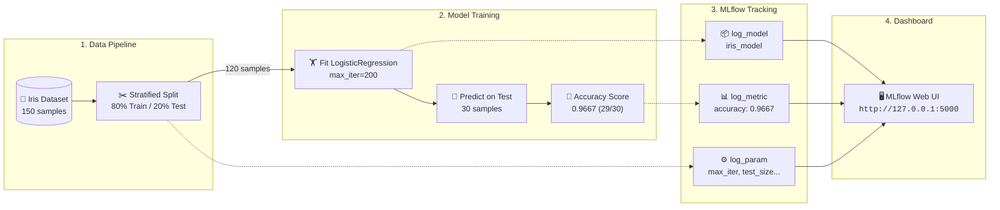

<div align="center">

<p align="center">
  <a href="../02-Setup/README.md">⬅️ Lesson 02: Setup</a> •
  <a href="../README.md">🏠 Home</a> •
  <b>Lesson 03: First Experiment</b> •
  <a href="../04-Tracking-fundamentals/README.md">Lesson 04: Fundamentals ➡️</a>
</p>

# 🧪 Lesson 03: Your First MLflow Experiment
### *Tracking Model Training, Hyperparameters, Metrics & Artifacts*

</div>

Time to write real code. In this lesson you will train a simple classifier on the Iris flower dataset and use MLflow to record the settings, the result, and the trained model. Then you will open the MLflow interface and inspect them.

> [!IMPORTANT]
> **Operating system:** Commands are written for **Windows 11 with Windows PowerShell**.

> [!NOTE]
> **Version note:** This tutorial targets **MLflow 3.17.0**. In MLflow 3, a model is logged with `name="..."`. Many older tutorials use `artifact_path="..."` instead, so code copied from older sources may not match.

---

## 🎯 1. Learning objectives

By the end of this lesson you will be able to:

- 📊 **Load a dataset** and split it into training and test sets.
- 🤖 **Train a simple classification model** with scikit-learn.
- 🌐 **Connect a script** to the MLflow tracking server.
- 📁 **Create an experiment** and start a tracked run.
- 📝 **Log parameters, a metric, and a trained model**.
- 🖥️ **Find and read the results** in the MLflow web interface.

---

## 📋 2. Prerequisites

- Completed [Lesson 02](../02-Setup/README.md): Virtual environment created, packages installed, and you can start the tracking server.
- The Iris dataset needs no external download; it is built into scikit-learn.

**Files reused from earlier lessons:**
- `requirements.txt`
- The `.venv` environment folder
- The server command from Lesson 02

**New file in this lesson:**
- `03-First-experiment/train.py`

---

## 💡 3. Concepts in plain English

### The Iris dataset
The Iris dataset contains 150 flowers across three species (*Setosa, Versicolour, Virginica*). Each flower has four measurements (sepal length, sepal width, petal length, petal width). Your task is to predict the species from those measurements. It is small, clean, and well-known, making it the ideal first example. It is a **classification** problem where the model chooses one of three classes.

### Training and test sets
You split the data into two parts:
- The model **learns** from the **training set** (80% = 120 flowers).
- You **evaluate** performance on the **test set** (20% = 30 flowers) that the model has never seen. This tells you how well it generalizes to new flowers.

### Accuracy
Accuracy is the share of test flowers the model classified correctly. If it gets 29 of 30 correct, accuracy is $29 / 30 = 0.9667$ (96.67%).



### What we will record in MLflow

| Kind | What we log | Why |
|:---|:---|:---|
| ⚙️ **Parameters** | `model_type`, `max_iter`, `test_size`, `random_state` | The exact settings that produced this result |
| 📊 **Metric** | `accuracy` | The quantifiable performance result |
| 📦 **Model** | The trained scikit-learn model | Stored so we can load it to make predictions later |

---

## 🚀 4. Step-by-step instructions

### Step 1: Start the tracking server

Follow Step 7 of [Lesson 02](../02-Setup/README.md#step-7-start-the-mlflow-tracking-server). In **PowerShell Window 2**, from the repository root, with the environment active:

```powershell
mlflow server --backend-store-uri sqlite:///mlflow.db --host 127.0.0.1 --port 5000
```

> [!TIP]
> Leave this window open. If the server is already running from before, you do not need to restart it.

---

### Step 2: Create the script file

Inside the repository root, ensure you have the folder named `03-First-experiment`. Save the code from the next section as `train.py` inside that folder, so the path is:

```text
mlflow-for-beginners\03-First-experiment\train.py
```

---

### Step 3: Run the script

Use **PowerShell Window 1** (the coding terminal, not the server terminal). Navigate to the repository root, make sure `(.venv)` is active, and run the command in [Section 8](#8-commands-to-run).

---

## 💻 5. The complete code

Save this code as **`03-First-experiment/train.py`**:

```python
"""Lesson 03: your first MLflow experiment.

Trains a logistic regression classifier on the Iris dataset and records
the settings, the result, and the trained model in MLflow.

Before running this script, start the MLflow tracking server (see Lesson 02).
"""

import mlflow
import mlflow.sklearn
from sklearn.datasets import load_iris
from sklearn.linear_model import LogisticRegression
from sklearn.metrics import accuracy_score
from sklearn.model_selection import train_test_split

# --- Settings -----------------------------------------------------------
TRACKING_URI = "http://127.0.0.1:5000"   # the server from Lesson 02
EXPERIMENT_NAME = "iris-first-experiment"
TEST_SIZE = 0.2
RANDOM_STATE = 42
MAX_ITER = 200

# --- 1. Connect to MLflow and choose an experiment ----------------------
mlflow.set_tracking_uri(TRACKING_URI)
mlflow.set_experiment(EXPERIMENT_NAME)

# --- 2. Load the data and split it --------------------------------------
X, y = load_iris(return_X_y=True)
X_train, X_test, y_train, y_test = train_test_split(
    X, y, test_size=TEST_SIZE, random_state=RANDOM_STATE, stratify=y
)

# --- 3. Train and track inside one MLflow run ---------------------------
with mlflow.start_run(run_name="logistic-regression-baseline"):
    # Parameters: the settings we chose
    mlflow.log_param("model_type", "LogisticRegression")
    mlflow.log_param("max_iter", MAX_ITER)
    mlflow.log_param("test_size", TEST_SIZE)
    mlflow.log_param("random_state", RANDOM_STATE)

    # Train the model
    model = LogisticRegression(max_iter=MAX_ITER, random_state=RANDOM_STATE)
    model.fit(X_train, y_train)

    # Evaluate on the test set
    predictions = model.predict(X_test)
    accuracy = accuracy_score(y_test, predictions)

    # Metric: the result we measured
    mlflow.log_metric("accuracy", accuracy)

    # Save the trained model with the run
    mlflow.sklearn.log_model(sk_model=model, name="iris_model")

print(f"Test accuracy: {accuracy:.4f}")
print(f"Open {TRACKING_URI} and select the 'Model training' view to see the run.")
```

---

## 🔍 6. The code, section by section

- **Imports:** `mlflow` and `mlflow.sklearn` are for tracking. The `sklearn` imports are for the data, the model, the accuracy measure, and the train/test split. All imports are grouped at the top so you can clearly see the dependencies.
- **Settings:** Values you may want to tune are written in uppercase constants at the top. This avoids typing the same value in several places.
- **Step 1: Connect:** `mlflow.set_tracking_uri(...)` points the script to your running server. Without it, MLflow would default to writing files locally. `mlflow.set_experiment(...)` chooses the experiment name and creates it if it doesn't already exist.
- **Step 2: Load and split:** `load_iris(return_X_y=True)` returns the measurements (`X`) and the species (`y`). `train_test_split` partitions them:
  - `test_size=0.2` reserves 20% for testing.
  - `random_state=42` ensures the split is reproducible every time you run it.
  - `stratify=y` guarantees the same proportion of each flower species across both splits.
- **Step 3: The run:** `with mlflow.start_run(run_name=...):` initiates the run. Everything inside this indented block is tracked, and the run cleanly finishes when the block exits (even if an error occurs).
  - `mlflow.log_param(...)` records hyperparameter choices.
  - `model.fit(...)` trains the classifier.
  - `accuracy_score(...)` tests predictions against ground-truth labels.
  - `mlflow.log_metric("accuracy", accuracy)` saves the calculated metric.
  - `mlflow.sklearn.log_model(sk_model=model, name="iris_model")` serializes the trained model directly to the tracking server's artifact repository.
- **The print statements:** Output a concise terminal confirmation; they are not part of MLflow itself.

---

## 💾 7. Files and storage

Nothing new is created inside the lesson folder when you execute the script. The script transmits everything over HTTP to the server, which stores the data where it was launched:

| What | Where |
|:---|:---|
| ⚙️ Parameters, metric, run information | `mlflow.db` in the repository root |
| 📦 Saved model artifacts | The `mlartifacts/` folder in the repository root |

*(Both are ignored by Git).*

---

## ⌨️ 8. Commands to run

In **PowerShell Window 1**, from the repository root, with `(.venv)` showing:

```powershell
python 03-First-experiment\train.py
```

---

## 📋 9. Expected output

In your terminal, you should see output similar to:

```text
2026/10/10 21:16:23 INFO mlflow.tracking.fluent: Experiment with name 'iris-first-experiment' does not exist. Creating a new experiment.
View run logistic-regression-baseline at: http://127.0.0.1:5000/#/experiments/2/runs/<a-long-id>
View experiment at: http://127.0.0.1:5000/#/experiments/2
Test accuracy: 0.9667
Open http://127.0.0.1:5000 and select the 'Model training' view to see the run.
```

- The first line appears only on the initial run when the experiment is created.
- The experiment ID depends on how many experiments already exist (e.g. `2` if `setup-check` was run first).
- The test accuracy is `0.9667` (29 of 30 test flowers correct). Because `random_state=42` is fixed, rerunning the script yields the exact same accuracy.

---

### 🖥️ What to inspect in the MLflow UI

Open **`http://127.0.0.1:5000`** and verify **Model training** is selected in the top-left switch:

1. 📂 Open the experiment **`iris-first-experiment`**.
2. 🏃 Open the run named **`logistic-regression-baseline`**.
3. ⚙️ Inspect the four parameters: `model_type`, `max_iter`, `test_size`, and `random_state`.
4. 📊 Inspect the metric: `accuracy = 0.9667`.
5. 📦 Switch to the experiment's **Models** / **Artifacts** view to inspect `iris_model`.
6. ⏱️ Notice metadata MLflow recorded automatically (run status, execution duration, timestamp).

---

## ⚠️ 10. Common errors and solutions

| Problem | Cause & Fix |
|:---|:---|
| 🥶 **Script freezes, then fails with `API request ... failed`** | The tracking server is not running. Launch it in Window 2 and rerun. See [Lesson 02](../02-Setup/README.md#10-common-errors-and-solutions). |
| ❓ **`ModuleNotFoundError: No module named 'mlflow'` (or `sklearn`)** | Virtual environment is not activated. Run `.\.venv\Scripts\Activate.ps1`. |
| 📁 **`can't open file ... train.py`** | You are not in the repository root or path is misspelled. Run `Get-Location` to verify. |
| 🪟 **Web page shows "Traces", "Sessions", or "No data available"** | You are in the **GenAI** view. Switch to **Model training** at top-left. |
| 🔍 **Cannot find experiment in UI** | Check for typos in experiment name, and ensure the server was launched from the repository root. |

---

## 🧠 11. Practice exercises

1. **Rerun test:** Run the script a second time. How many runs does the experiment have now? Is the accuracy identical? Why?
2. **Hyperparameter tweak:** Change `MAX_ITER = 100`, run the script, and compare the two runs in the UI. Did accuracy change?
3. **Data partition adjustment:** Set `TEST_SIZE = 0.3`, run the script, and check the `test_size` parameter in the new run.
4. **Random seed exploration:** Set `RANDOM_STATE = 7`, run the script, and inspect whether accuracy differs. What does this reveal about a single metric on a small dataset?

---

## 🏆 12. Small challenge

Create a copy of `train.py` called `train_knn.py` in the same folder:
1. Replace `LogisticRegression` with scikit-learn's `KNeighborsClassifier` (from `sklearn.neighbors`).
2. Log `n_neighbors` as a parameter instead of `max_iter`.
3. Set `run_name="knn-baseline"` and `model_type="KNeighborsClassifier"`.
4. Run the script and compare both model runs side-by-side in the MLflow UI!

---

## 📝 13. Summary

- 🔌 Connect to your server with `mlflow.set_tracking_uri(...)` and select an experiment with `mlflow.set_experiment(...)`.
- 🏃 The context manager `with mlflow.start_run():` handles run lifecycle cleanly.
- ⚙️ `log_param` stores inputs, `log_metric` records outputs, and `log_model` preserves trained model artifacts.
- 🎯 Setting `random_state` guarantees reproducible splits and metrics.
- 🔄 Every execution logs a fresh run to the experiment for effortless history tracking.
- 🖥️ Results are browsed in the **Model training** view of the MLflow web dashboard.

---

## 📚 14. Next lesson and official documentation

- [MLflow Tracking Quickstart](https://mlflow.org/docs/latest/ml/tracking/quickstart/)
- [MLflow Tracking Guide](https://mlflow.org/docs/latest/ml/tracking/)
- [Tracking APIs Reference](https://mlflow.org/docs/latest/ml/tracking/tracking-api/)

<div align="center">
  <br/>
  <a href="../04-Tracking-fundamentals/README.md"><b>Next: Lesson 04: Understanding Experiment Tracking ➡️</b></a>
</div>

---

## 🧪 Testing status

| Part | Status |
|:---|:---|
| `train.py` runs without errors against SQLite-backed MLflow 3.17.0 server; params, metric, and model read back | ✅ **Passed on Linux** (test environment). Accuracy `0.9667`, identical on rerun |
| `train.py` on Windows 11 (PowerShell, Python 3.13.3) | ✅ **Passed on Windows 11**, confirmed by author. Accuracy `0.9667`, no warnings |
| Results in Model training UI view | ✅ **Confirmed on Windows 11**: All 4 parameters, metric, and model listed correctly |