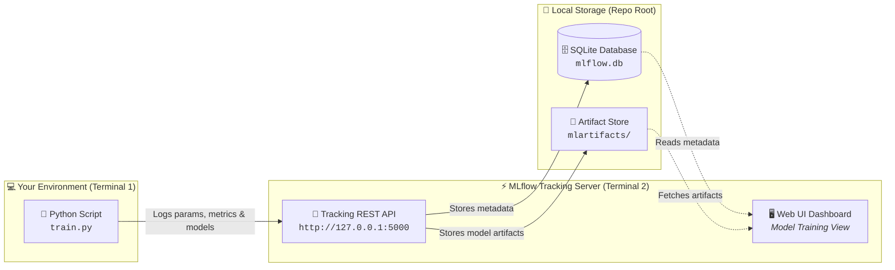

<div align="center">

# 🧪 MLflow for Beginners
### *From Zero to Experiment Tracking*

A hands-on, step-by-step tutorial series that teaches you how to use [MLflow](https://mlflow.org/docs/latest/ml/) to track your machine learning experiments. You start from nothing, run every example on your own computer, and finish with a small end-to-end project.

---

[](https://mlflow.org/)
[](https://www.python.org/)
[](https://scikit-learn.org/)
[](https://microsoft.com/windows)
[](#project-status)

<p align="center">
  <a href="#-why-mlflow-matters">Why MLflow</a> •
  <a href="#-what-you-will-learn">What You'll Learn</a> •
  <a href="#-who-this-is-for">Who This Is For</a> •
  <a href="#-lesson-roadmap">Lesson Roadmap</a> •
  <a href="#-quick-start">Quick Start</a> •
  <a href="#%EF%B8%8F-technology-stack">Tech Stack</a> •
  <a href="#-repository-structure">Structure</a>
</p>

</div>

> [!NOTE]
> **Project status:** Work in progress. Lessons 01 to 03 are ready, and Lessons 02 and 03 have been run and tested on Windows 11. Lessons 04 to 08 are planned and not written yet. See [Project status](#-project-status) for details.

---

## 💡 Why MLflow matters

When you train machine learning models, you quickly end up with many experiments: different settings, different data splits, different results. Without a system, it becomes hard to answer simple questions such as *"Which settings gave me my best result?"* or *"How did I create this model file?"*

**MLflow** is an open-source platform that records this information for you. Its **experiment tracking** feature logs the settings (parameters), results (metrics), and output files (such as trained models) of each run, and shows them in a web interface where you can browse and compare them. You can read the official description in the [MLflow Tracking documentation](https://mlflow.org/docs/latest/ml/tracking/).



---

## 🎯 What you will learn

By the end of this series you will be able to:

- 📌 **Explain** what experiment tracking is and why it matters.
- ⚙️ **Install and run** MLflow on Windows 11 using PowerShell.
- 📝 **Log parameters, metrics, tags, and models** from a scikit-learn training script.
- 🖥️ **Use the MLflow web interface** to inspect and compare runs.
- 🤖 **Use autologging**, and understand what it does and does not capture.
- ⚖️ **Compare several models** in a fair way and pick one with a clear justification.
- 📦 **Load a logged model** to make predictions, and understand model registration.
- 🚀 **Combine everything** into a small, tested, reproducible project.

---

## 👥 Who this is for

- **Audience:** Complete beginners to MLflow.
- **Prerequisites:**
  - Basic Python (functions, imports, running a script).
  - Some familiarity with machine learning (what training, testing, and accuracy mean).
  - A Windows 11 computer with Python installed ([Lesson 02](02-Setup/README.md) shows how to check this).

> [!TIP]
> You do **not** need any prior knowledge of MLflow or MLOps.

---

## 🗺️ Lesson roadmap

Follow the lessons in order. Each one builds on the previous one.

| # | Lesson | What you will do | Status |
|:---:|:---|:---|:---:|
| **01** | [Introduction to MLflow](01-Introduction/README.md) | Learn the core ideas: experiments, runs, parameters, metrics, tags, artifacts | 🟢 **Ready** |
| **02** | [Installation and Setup](02-Setup/README.md) | Create a virtual environment, install MLflow, start the tracking server | 🧪 **Ready** *(tested on Win 11)* |
| **03** | [Your First MLflow Experiment](03-First-experiment/README.md) | Train a model on the Iris dataset and log it | 🧪 **Ready** *(tested on Win 11)* |
| **04** | [Understanding Experiment Tracking](04-Tracking-fundamentals/README.md) | Look closely at runs, tags, artifacts, and how data is stored | ⏳ **Planned** |
| **05** | [Autologging](05-autologging/README.md) | Let MLflow record information automatically | ⏳ **Planned** |
| **06** | [Comparing Experiments](06-Comparing-experiments/README.md) | Compare models fairly and choose one | ⏳ **Planned** |
| **07** | [Model Management](07-Model-management/README.md) | Load models, make predictions, learn about the Model Registry | ⏳ **Planned** |
| **08** | [End-to-End Mini Project](08-mini-project/README.md) | Combine everything into a small tested project | ⏳ **Planned** |

> [!NOTE]
> Extra material (also planned): [glossary](resources/glossary.md), [troubleshooting guide](resources/troubleshooting.md), and a companion [article](article/mlflow-for-beginners.md).
>
> Links to lessons marked "Planned" will not work until those lessons are added.

---

## ⚡ Quick start

These commands are for **Windows PowerShell** and should be run from the repository folder. [Lesson 02](02-Setup/README.md) explains each command in detail and covers common errors.

### 1. Environment & Package Setup

Run these commands in your primary PowerShell terminal:

```powershell
# 1. Create a virtual environment (isolated packages for this project)
python -m venv .venv

# 2. Activate it
.\.venv\Scripts\Activate.ps1

# 3. Install the exact package versions used in this tutorial
python -m pip install -r requirements.txt

# 4. Check that everything imports
python -c "import mlflow, sklearn, pandas, numpy; print(mlflow.__version__, sklearn.__version__, pandas.__version__, numpy.__version__)"
```

If step 4 prints `3.17.0 1.9.1 3.0.6 2.5.3`, your setup matches the one used in this tutorial.

> [!WARNING]
> If step 2 fails with a message about scripts being disabled, see the [common errors in Lesson 02](02-Setup/README.md#10-common-errors-and-solutions) for the fix.

---

### 2. Launch the Tracking Server

To see MLflow working straight away, open a **second** PowerShell window, activate the environment there too, and start the tracking server from the repository folder:

```powershell
mlflow server --backend-store-uri sqlite:///mlflow.db --host 127.0.0.1 --port 5000
```

---

### 3. Run Your First Experiment

In your **first** window, run the example from Lesson 03:

```powershell
python 03-First-experiment\train.py
```

Now open **`http://127.0.0.1:5000`** in your browser and select **Model training** at the top-left to see your first run.

> [!TIP]
> For the full explanation, start with [Lesson 01](01-Introduction/README.md).

---

## 🛠️ Technology stack

| Tool | Version | Purpose |
|:---|:---:|:---|
| **Python** | `3.13.3` | Programming language |
| **MLflow** | `3.17.0` | Experiment tracking and model management |
| **scikit-learn** | `1.9.1` | Machine learning models and the Iris dataset |
| **pandas** | `3.0.6` | Data handling |
| **numpy** | `2.5.3` | Numerical computing |

- **About these versions:** This exact combination was installed together and imported successfully on the author's Windows 11 machine. The code in Lessons 02 and 03 was run on that machine with these versions. This section will be updated as each new lesson is tested.
- **Why versions are pinned:** MLflow changes between releases, and many tutorials online were written for older versions. This repository targets **MLflow 3.17.0**. If you use a different version, some code or screens may differ.

> [!NOTE]
> The official MLflow documentation links in this repository point to the `latest` documentation, which may describe a newer version than 3.17.0.

---

## 📂 Repository structure

This is the planned structure. Lessons 01 to 03 are in the repository, and the rest appear as each lesson is completed.

```text
mlflow-for-beginners/
├── README.md                    <- you are here
├── requirements.txt             <- pinned package versions
├── .gitignore
├── LICENSE
├── 01-Introduction/             <- concepts (no code to run)
├── 02-Setup/                    <- installation and tracking server
├── 03-First-experiment/         <- first run, train.py
├── 04-Tracking-fundamentals/    <- runs, tags, artifacts, train.py
├── 05-autologging/              <- autologging, train.py
├── 06-Comparing-experiments/    <- compare_models.py
├── 07-Model-management/         <- loading models, predict.py
├── 08-mini-project/             <- src/ and tests/
├── resources/                   <- glossary.md, troubleshooting.md
├── article/                     <- companion article
└── screenshots/                 <- real screenshots from the MLflow UI
```

---

## 🎓 Teaching approach

- 💬 **Plain English first:** Each concept is explained without assuming MLOps knowledge.
- 🌱 **One example that grows:** Lessons 03 to 05 extend the same Iris example instead of starting a new project each time.
- ⚡ **Everything is runnable:** Each lesson lists the full code, the commands to run, and what you should see.
- 🔬 **Honest about testing:** A lesson is only marked complete after its code has actually been run. Nothing in this repository claims results that were not produced.
- 📐 **Same format every time:** Each lesson uses the same sections: objectives, prerequisites, concepts, steps, code, expected output, common errors, exercises, and a summary.

---

## 📚 Official learning resources

- [MLflow documentation for machine learning](https://mlflow.org/docs/latest/ml/)
- [MLflow Tracking](https://mlflow.org/docs/latest/ml/tracking/)
- [MLflow Tracking Quickstart](https://mlflow.org/docs/latest/ml/tracking/quickstart/)
- [Tracking APIs](https://mlflow.org/docs/latest/ml/tracking/tracking-api/)
- [Tracking experiments with a local database](https://mlflow.org/docs/latest/ml/tracking/tutorials/local-database/)
- [MLflow Model](https://mlflow.org/docs/latest/ml/model/)
- [MLflow Model Registry](https://mlflow.org/docs/latest/ml/model-registry/)

---

## 📊 Project status

| Item | Status |
|:---|:---:|
| Repository design and dependency versions | ✅ **Done** |
| Root README | ✅ **Done for now**, updated as lessons are added |
| Lesson 01 | 🟢 **Ready** |
| Lessons 02 and 03 | 🧪 **Ready**, tested on Windows 11 |
| Lessons 04 to 08 | ⏳ **Not started** |
| Tests for the mini project | ⏳ **Not started** |
| Real screenshots | ⏳ **Not started** |
| Companion article | ⏳ **Not started** |

---

## 🤝 Contributing and feedback

Found a mistake, an unclear explanation, or a command that does not work for you? Please open an issue and include:

1. The lesson and step where the problem happened.
2. Your Python and MLflow versions.
3. The full error message.

Suggestions to make the lessons clearer for beginners are welcome.

---

## ✍️ Author

- **Name:** *to be added*
- **GitHub:** *to be added*
- **LinkedIn:** *to be added*

---

## 📄 License

See the [LICENSE](LICENSE) file for details.